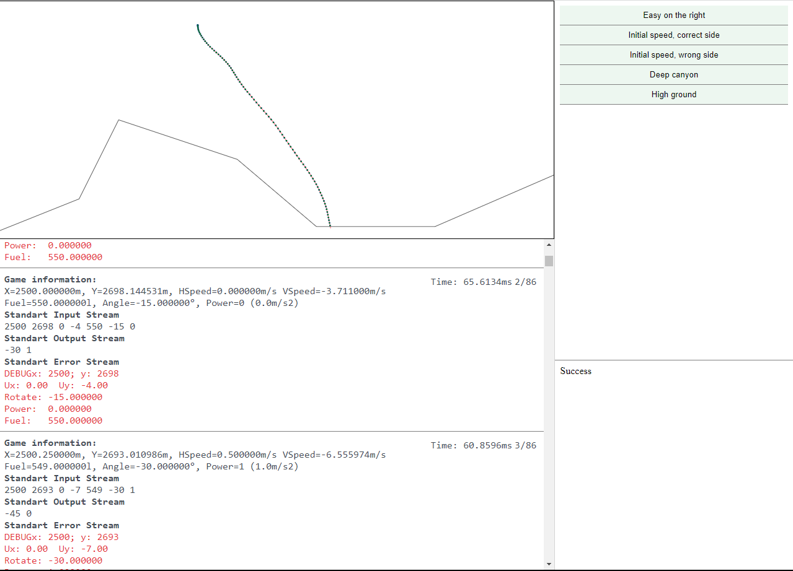

# tester
Консольная утилита для локального тестирования задач с [codingame](https://www.codingame.com/)
в рамках курса CS253. Интеллектуальные системы.

Тестирует скомпилированное решение, выводит краткий отчёт в консоль, полный отчёт рендерится в виде html-файла.
## Использование
```
> tester
Usage:
tester [flags] path/to/solution.exe
  -open
    	Open report in default browser.
  -output string
    	File with report. (default "mars-lander-report-hh_mm_ss.html")
  -styles string
    	Path to file with custom styles.
  -timeout duration
    	Timeout for one test. (default 1m0s)
```
`tester -open -timeout 30m -output report.html solution.exe` - запустит тесты с mars-lander с ограничением времени 30 минут на каждый тест,
  сохранит отчёт в файл `report.html`, который откроется в браузере по умолчанию по окончанию тестирования.
```
> tester goodsolution.exe
0. Easy on the right: Success
1. Initial speed, correct side: Success
2. Initial speed, wrong side: Success
3. Deep canyon: Success
4. High ground: Success
Report saved to mars-lander-report-20_17_29.html

> tester badsolution.exe
0. Easy on the right: Failure: Mars Lander spent all the fuel
1. Initial speed, correct side: Failure: Mars Lander is lost in outer space... and Opportunity with it.
2. Initial speed, wrong side: Failure: Mars Lander is lost in outer space... and Opportunity with it.
3. Deep canyon: Failure: Mars Lander crashed. Opportunity has been destroyed.
4. High ground: Failure: Mars Lander crashed. Opportunity has been destroyed.
Report saved to mars-lander-report-20_18_58.html
```

## Поддерживаемые задачи
1. [Mars Lander 2](https://www.codingame.com/ide/puzzle/mars-lander) - сейчас запускается по умолчанию

